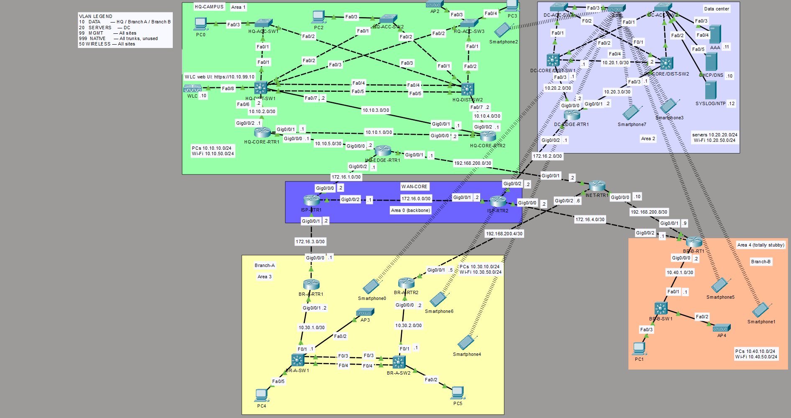

# Multi-Site Enterprise Network Lab

A four-site enterprise network (HQ, data center and two branches) built in Cisco Packet Tracer and connected through a simulated WAN. Configured routing, redundancy, wireless and management/access controls, tested three failover scenarios, and documented 13 troubleshooting cases using a structured NOC-style workflow.

**Read next:** [Troubleshooting](TROUBLESHOOTING.md) · [Key findings](docs/key-findings.md) · [Full overview](docs/full-overview.md) · [All 13 incident reports](incidents/README.md) · [Device configs](configs/README.md)

*Topology as built in Packet Tracer. The dotted lines are wireless associations; some phones joined an AP at another site (see [known limitations](docs/known-limitations.md)).*

---

## What was built

| | |
|---|---|
| **Scale** | 22 routers and switches, a wireless controller, 4 access points, 3 servers, 4 sites |
| **Routing** | OSPF in 5 areas (Branch B totally stubby), floating static backup routes |
| **Redundancy** | HSRP gateway pairs aligned with STP roots, LACP EtherChannel, GRE-over-IPsec backup tunnels to both branches |
| **Security** | SSH-only management with a VTY ACL on 19 devices, two traffic ACLs, DHCP snooping and DAI at HQ and Branch A, port security |
| **Services** | Central DHCP/DNS, AAA (TACACS+ on two routers, RADIUS for wireless), syslog/NTP, SNMPv2c, PAT on all four edge routers |
| **Wireless** | WPA2-Enterprise (802.1X): one controller, four access points, one per site |

## What was tested

| Test | Result | Evidence |
|---|---|---|
| Branch A and Branch B primary WAN link down | Traffic moves to the IPsec tunnel | Captured output |
| HQ gateway failover | Pass, including the data plane (switch isolated at port level) | Captured output |
| `DATA-IN` ACL blocks user VLAN → management VLAN | Pass | Blocked ping + counters (tested on HQ-DIST-SW1) |
| `DC-SERVER-ACCESS` ACL final state | 0 hits on the closing `deny ip any any` | Captured output |
| DHCP relay and leases at HQ, Branch A, Branch B | Pass | Operator-observed |
| Wireless client login at HQ, DC, Branch B | Pass (Branch A not confirmed) | Operator-observed |

## Open items

After the file is loaded, one GRE-over-IPsec tunnel can stick. The cause has not been established; a recovery procedure is documented ([INC-13](incidents/INC-13-gre-ipsec-stuck-sa-after-load.md)). Other platform notes: [known limitations](docs/known-limitations.md).

---

**Skills shown:** OSPF · HSRP · STP and EtherChannel · VLANs and trunking · ACLs · NAT/PAT · DHCP snooping and DAI · GRE-over-IPsec · RADIUS 802.1X · structured troubleshooting

*How I worked: Configured, tested and troubleshot all 22 devices from a design specification, with daily verification checks. To practise NOC-style diagnosis, 6 faults were seeded into the build and diagnosed without being told the fault location, while 7 additional unplanned defects surfaced during implementation. Each incident was investigated from symptoms using show-command evidence and packet traces.*

*Author: Muhannad · CCNA 200-301. Contact details are on my GitHub profile.*
